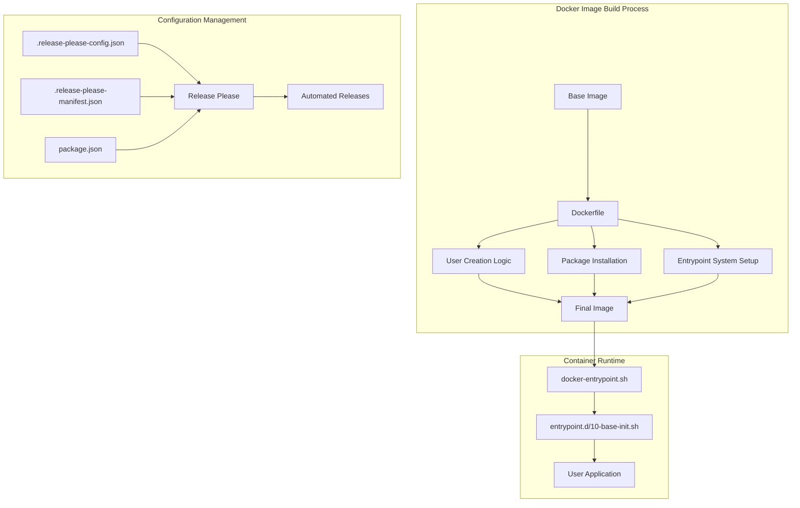

# Design Document: Docker Base Template Migration

## Overview

This design document outlines the technical approach for migrating and standardizing the Docker base template project. The migration will align the target "base" project with proven patterns from the reference "base0" project while updating to the latest base images and ensuring consistency across Alpine, Debian, and Rocky Linux distribution variants.

### Project Context

The base project serves as a foundational template for other Docker container projects, providing:
- Standardized Dockerfiles with OCI annotations
- Flexible entrypoint system supporting custom initialization scripts
- Consistent environment variable configuration
- Multi-architecture support
- User/group management with PUID/PGID support

### Migration Goals

1. **Standardization**: Align all distribution variants with Base0_Project proven patterns
2. **Modernization**: Update to latest base image versions (Alpine 3.23.4, Debian 13.4.0, Rocky 10.1.0)
3. **Consistency**: Ensure identical behavior across Alpine, Debian, and Rocky variants where appropriate
4. **Maintainability**: Establish clear configuration management with Release Please automation
5. **Quality**: Implement atomic commit strategy with comprehensive validation

### Design Principles

- **Single Source of Truth**: Base0_Project serves as the reference implementation
- **Distribution-Specific Adaptations**: Preserve necessary differences (package managers, user creation commands)
- **Idempotency**: All scripts and configurations must be safely re-runnable
- **Cross-Platform Compatibility**: Support Linux, macOS, and Windows development environments
- **Atomic Changes**: Each logical change committed independently with clear traceability

## Architecture

### Directory Structure


```
base/                                    # Target project (workspace root)
├── alpine/
│   ├── Dockerfile                       # Alpine-specific Dockerfile
│   ├── docker-entrypoint.sh            # POSIX-compliant entrypoint script
│   └── entrypoint.d/
│       └── 10-base-init.sh             # Initialization script
├── debian/
│   ├── Dockerfile                       # Debian-specific Dockerfile
│   ├── docker-entrypoint.sh            # POSIX-compliant entrypoint script
│   └── entrypoint.d/
│       └── 10-base-init.sh             # Initialization script
├── rocky/
│   ├── Dockerfile                       # Rocky-specific Dockerfile
│   ├── docker-entrypoint.sh            # POSIX-compliant entrypoint script
│   └── entrypoint.d/
│       └── 10-base-init.sh             # Initialization script
├── .release-please-config.json          # Release automation configuration
├── .release-please-manifest.json        # Version tracking manifest
├── package.json                         # Project metadata and tooling
├── .gitattributes                       # Line ending normalization
└── .kiro/specs/docker-base-template-migration/  # Spec documentation

base0/                                   # Reference project (read-only)
├── alpine/                              # Reference Alpine implementation
├── debian/                              # Reference Debian implementation
└── rocky/                               # Reference Rocky implementation
```

### Component Architecture



### Multi-Root Workspace Configuration

The project operates in a multi-root workspace with two distinct roots:
- **base**: Target project where all new files are created
- **base0**: Reference project (read-only) for pattern extraction

Path resolution strategy:
- All file creation operations target `base/` workspace root
- All reference file reads target `base0/` workspace root
- No modifications to base0 project files
- Relative paths resolved correctly for each workspace context

## Components and Interfaces

### 1. Dockerfile Component

**Purpose**: Define container image build instructions with standardized patterns

**Structure** (per distribution variant):

```dockerfile
# Base image declaration
FROM snowdreamtech/{distribution}:{version}

# OCI annotations
LABEL org.opencontainers.image.authors="Snowdream Tech"
LABEL org.opencontainers.image.title="Base Image Based On {Distribution}"
# ... additional labels

# User and workdir setup
USER root
WORKDIR /root

# Build arguments
ARG KEEPALIVE=0
ARG CAP_NET_BIND_SERVICE=0
# ... additional args

# Environment variables
ENV KEEPALIVE=${KEEPALIVE}
ENV CAP_NET_BIND_SERVICE=${CAP_NET_BIND_SERVICE}
# ... additional envs

# User creation logic (distribution-specific)
RUN [user creation commands]

# Package installation (distribution-specific)
RUN [package manager commands]

# Entrypoint system setup
COPY entrypoint.d /usr/local/bin/entrypoint.d
COPY docker-entrypoint.sh /usr/local/bin/docker-entrypoint.sh
RUN chmod +x /usr/local/bin/docker-entrypoint.sh \
    && chmod +x /usr/local/bin/entrypoint.d/*

ENTRYPOINT ["docker-entrypoint.sh"]
```

**Distribution-Specific Variations**:

| Aspect | Alpine | Debian | Rocky |
|--------|--------|--------|-------|
| Base Image | snowdreamtech/alpine:3.23.4 | snowdreamtech/debian:13.4.0 | snowdreamtech/rocky:10.1.0 |
| Package Manager | apk | apt-get | dnf |
| User Creation | addgroup/adduser | addgroup/adduser | groupadd/useradd |
| Shell | /bin/sh | /bin/bash | /bin/bash |
| Extra ENV | - | DEBIAN_FRONTEND=noninteractive | - |

**Interface Contract**:
- Input: Build arguments (PUID, PGID, USER, etc.)
- Output: Container image with entrypoint system configured
- Side Effects: Creates user/group if specified, installs packages

### 2. Entrypoint System Component

**Purpose**: Provide extensible container initialization mechanism

**docker-entrypoint.sh**:

```bash
#!/bin/sh
set -e

if [ "$DEBUG" = "true" ]; then
    echo "→ [ENTRYPOINT] Executing all scripts in /usr/local/bin/entrypoint.d"
fi

for script in /usr/local/bin/entrypoint.d/*; do
  if [ -x "$script" ]; then
    if [ "$DEBUG" = "true" ]; then
        echo "→ Running $script"
    fi
    "$script" "$@"
  else
    if [ "$DEBUG" = "true" ]; then
        echo "⚠️ Skipping $script (not executable)"
    fi
  fi
done

if [ "$DEBUG" = "true" ]; then
    echo "→ [ENTRYPOINT] Done."
fi
```

**Key Characteristics**:
- POSIX-compliant (#!/bin/sh) for maximum compatibility
- Fail-fast with `set -e`
- Iterates through `/usr/local/bin/entrypoint.d/*` in lexical order
- Executes only files with executable bit set
- Supports DEBUG mode for troubleshooting
- Passes all arguments to each script

**entrypoint.d/10-base-init.sh**:

Minimal initialization script following Base0_Project pattern. Serves as extension point for future initialization logic.

**Interface Contract**:
- Input: Command-line arguments passed to container
- Output: Initialized container environment
- Side Effects: Executes all scripts in entrypoint.d directory
- Error Handling: Exits immediately on any script failure (set -e)

### 3. Configuration Management Component

**Purpose**: Automate version management and release generation

**.release-please-config.json**:

```json
{
  "packages": {
    "alpine": {
      "release-type": "simple",
      "component": "alpine",
      "include-v-in-tag": true
    },
    "debian": {
      "release-type": "simple",
      "component": "debian",
      "include-v-in-tag": true
    },
    "rocky": {
      "release-type": "simple",
      "component": "rocky",
      "include-v-in-tag": true
    }
  },
  "extra-files": [...],
  "changelog-sections": [...],
  "pull-request-title-pattern": "..."
}
```

**.release-please-manifest.json**:

```json
{
  "alpine": "3.23.4",
  "debian": "13.4.0",
  "rocky": "10.1.0"
}
```

**package.json**:

```json
{
  "name": "docker-base-template",
  "version": "1.0.0",
  "description": "Docker base template with standardized patterns",
  "packageManager": "pnpm@...",
  "devDependencies": {
    "@commitlint/cli": "...",
    "@commitlint/config-conventional": "..."
  }
}
```

**Interface Contract**:
- Input: Conventional commit messages
- Output: Automated version bumps, changelogs, and releases
- Integration: GitHub Actions workflow triggers Release Please

### 4. Environment Variable System

**Purpose**: Provide consistent configuration interface across all variants

**Standard Variables**:

| Variable | Type | Default | Purpose |
|----------|------|---------|---------|
| KEEPALIVE | ARG/ENV | 0 | Keep container running flag |
| CAP_NET_BIND_SERVICE | ARG/ENV | 0 | Enable binding to privileged ports |
| LANG | ARG/ENV | C.UTF-8 | Locale setting |
| UMASK | ARG/ENV | 022 | Default file creation mask |
| DEBUG | ARG/ENV | false | Enable debug output |
| PGID | ARG/ENV | 0 | Primary group ID for user creation |
| PUID | ARG/ENV | 0 | User ID for user creation |
| USER | ARG/ENV | root | Username for user creation |
| WORKDIR | ARG/ENV | /root | Working directory |
| DEBIAN_FRONTEND | ARG/ENV | noninteractive | Debian-specific: non-interactive mode |

**Usage Pattern**:

```bash
# Build-time customization
docker build --build-arg PUID=1000 --build-arg PGID=1000 --build-arg USER=appuser -t myimage .

# Runtime customization
docker run -e DEBUG=true -e KEEPALIVE=1 myimage
```

**Interface Contract**:
- Input: Build arguments or environment variables
- Output: Configured container behavior
- Validation: User creation only occurs when PUID≠0, PGID≠0, USER≠root

## Data Models

### Dockerfile Metadata Model

```typescript
interface DockerfileMetadata {
  baseImage: {
    registry: string;        // "snowdreamtech"
    distribution: string;    // "alpine" | "debian" | "rocky"
    version: string;         // "3.23.4" | "13.4.0" | "10.1.0"
  };

  ociAnnotations: {
    authors: string;
    title: string;
    description: string;
    documentation: string;
    baseName: string;
    licenses: string;
    source: string;
    vendor: string;
    version: string;
    url: string;
  };

  buildArgs: Record<string, string | number>;
  envVars: Record<string, string | number>;

  architectures: string[];   // ["amd64", "arm64", ...]
}
```

### Release Configuration Model

```typescript
interface ReleaseConfig {
  packages: Record<string, PackageConfig>;
  extraFiles: string[];
  changelogSections: ChangelogSection[];
  pullRequestTitlePattern: string;
}

interface PackageConfig {
  releaseType: "simple";
  component: string;
  includeVInTag: boolean;
}

interface ChangelogSection {
  type: string;
  section: string;
  hidden?: boolean;
}
```

### Commit Message Model

```typescript
interface ConventionalCommit {
  type: "feat" | "fix" | "docs" | "style" | "refactor" | "test" | "chore" | "ci" | "perf" | "build" | "revert";
  scope?: string;
  description: string;
  body?: string;
  footer?: string;
  breaking?: boolean;
}

// Validation rules:
// - Header (type + scope + description) ≤ 120 characters
// - Description must be lowercase (except acronyms)
// - Description must not end with period
// - Must use imperative mood ("add" not "added")
// - English only (no Chinese characters)
```

## Error Handling

### Build-Time Error Handling

**Package Installation Failures**:

```dockerfile
# Alpine
RUN apk update \
    && apk add --no-cache vim \
    || (echo "ERROR: Package installation failed" && exit 1)

# Debian
RUN set -eux \
    && DEBIAN_FRONTEND=noninteractive apt-get -qqy update \
    && DEBIAN_FRONTEND=noninteractive apt-get -qqy install --no-install-recommends vim \
    || (echo "ERROR: Package installation failed" && exit 1)

# Rocky
RUN set -eux \
    && dnf -y --allowerasing update \
    && dnf -y --allowerasing install vim \
    || (echo "ERROR: Package installation failed" && exit 1)
```

**User Creation Failures**:

The user creation logic includes guards to prevent errors:

```dockerfile
# Only create user if conditions are met
RUN if [ "${USER}" != "root" ] && [ ! -d "/home/${USER}" ] && [ "${PUID}" -ne 0 ] && [ "${PGID}" -ne 0 ]; then \
    # User creation commands \
    fi
```

Error scenarios handled:
- USER=root: Skip user creation (use root)
- PUID=0 or PGID=0: Skip user creation (invalid IDs)
- Home directory exists: Skip user creation (avoid conflicts)

### Runtime Error Handling

**Entrypoint Script Failures**:

```bash
#!/bin/sh
set -e  # Exit immediately on any error

# Error handling for script execution
for script in /usr/local/bin/entrypoint.d/*; do
  if [ -x "$script" ]; then
    "$script" "$@" || {
      echo "ERROR: Script $script failed with exit code $?"
      exit 1
    }
  fi
done
```

**Debug Mode**:

When DEBUG=true, the entrypoint provides detailed execution information:
- Script discovery and execution status
- Non-executable script warnings
- Execution flow tracking

### Configuration Error Handling

**Release Please Configuration**:

Validation requirements:
- All distribution variants must be defined in both config and manifest
- Version strings must follow semantic versioning
- Component names must match directory names

**Commit Message Validation**:

Enforced by commitlint with @commitlint/config-conventional:
- Type must be from allowed list
- Header ≤ 120 characters
- Description must be lowercase
- No period at end of description
- English only

Error feedback:
```bash
$ git commit -m "Fix: Update dockerfile"
⧗   input: Fix: Update dockerfile
✖   subject may not be empty [subject-empty]
✖   type must be one of [type-enum]
```

### Recovery Procedures

**Failed Build Recovery**:

1. Check build logs for specific error
2. Verify base image availability: `docker pull snowdreamtech/{distribution}:{version}`
3. Test package installation locally in base image
4. Verify network connectivity for package downloads
5. Check disk space: `df -h`

**Failed Entrypoint Recovery**:

1. Run container with DEBUG=true: `docker run -e DEBUG=true image`
2. Override entrypoint for debugging: `docker run --entrypoint /bin/sh image`
3. Check script permissions: `ls -la /usr/local/bin/entrypoint.d/`
4. Verify script syntax: `sh -n /usr/local/bin/docker-entrypoint.sh`

**Failed Release Recovery**:

1. Verify commit message format
2. Check Release Please workflow logs
3. Manually trigger workflow if needed
4. Verify branch protection rules allow Release Please bot

## Testing Strategy

### Testing Approach

This project involves **Infrastructure as Code (IaC)** - specifically Docker image definitions and build configurations. Property-based testing is **NOT applicable** for this type of work. Instead, we will use:

1. **Build Verification Tests**: Ensure images build successfully
2. **Runtime Behavior Tests**: Verify container initialization and configuration
3. **Integration Tests**: Test multi-architecture builds
4. **Validation Tests**: Verify configuration file correctness

### Test Categories

#### 1. Build Verification Tests

**Purpose**: Ensure all Dockerfiles build successfully with correct base images

**Test Cases**:

```bash
# Alpine build test
docker build -t base:alpine-test ./alpine/
docker inspect base:alpine-test --format='{{.Config.Image}}'
# Expected: snowdreamtech/alpine:3.23.4

# Debian build test
docker build -t base:debian-test ./debian/
docker inspect base:debian-test --format='{{.Config.Image}}'
# Expected: snowdreamtech/debian:13.4.0

# Rocky build test
docker build -t base:rocky-test ./rocky/
docker inspect base:rocky-test --format='{{.Config.Image}}'
# Expected: snowdreamtech/rocky:10.1.0
```

**Validation**:
- Build completes without errors
- Base image version matches specification
- All OCI labels present and correct
- Entrypoint configured correctly

#### 2. Runtime Behavior Tests

**Purpose**: Verify container initialization and environment configuration

**Test Cases**:

```bash
# Test default root user
docker run --rm base:alpine-test id
# Expected: uid=0(root) gid=0(root)

# Test custom user creation
docker build --build-arg PUID=1000 --build-arg PGID=1000 --build-arg USER=testuser -t base:alpine-custom ./alpine/
docker run --rm base:alpine-custom id
# Expected: uid=1000(testuser) gid=1000(testuser)

# Test DEBUG mode
docker run --rm -e DEBUG=true base:alpine-test
# Expected: Debug output showing entrypoint execution

# Test environment variables
docker run --rm base:alpine-test env | grep -E '(KEEPALIVE|LANG|UMASK)'
# Expected: KEEPALIVE=0, LANG=C.UTF-8, UMASK=022
```

**Validation**:
- User creation works correctly with PUID/PGID
- Environment variables set correctly
- Debug mode produces expected output
- Entrypoint scripts execute in order

#### 3. Entrypoint System Tests

**Purpose**: Verify entrypoint script execution and extensibility

**Test Cases**:

```bash
# Test entrypoint script execution
docker run --rm base:alpine-test ls -la /usr/local/bin/entrypoint.d/
# Expected: 10-base-init.sh with executable permissions

# Test script execution order
docker run --rm -e DEBUG=true base:alpine-test
# Expected: Scripts execute in lexical order (10-base-init.sh first)

# Test non-executable script handling
docker run --rm base:alpine-test sh -c "chmod -x /usr/local/bin/entrypoint.d/10-base-init.sh && docker-entrypoint.sh"
# Expected: Script skipped with warning in DEBUG mode

# Test error propagation
docker run --rm base:alpine-test sh -c "echo 'exit 1' > /usr/local/bin/entrypoint.d/99-fail.sh && chmod +x /usr/local/bin/entrypoint.d/99-fail.sh && docker-entrypoint.sh"
# Expected: Container exits with error code 1
```

**Validation**:
- Scripts execute in correct order
- Non-executable scripts skipped
- Errors propagate correctly (set -e)
- DEBUG mode shows execution flow

#### 4. Multi-Architecture Build Tests

**Purpose**: Verify images build for all supported architectures

**Test Cases**:

```bash
# Test multi-arch build for Alpine
docker buildx build --platform linux/amd64,linux/arm64,linux/arm/v7 -t base:alpine-multiarch ./alpine/

# Test multi-arch build for Debian
docker buildx build --platform linux/amd64,linux/arm64,linux/arm/v7 -t base:debian-multiarch ./debian/

# Test multi-arch build for Rocky
docker buildx build --platform linux/amd64,linux/arm64 -t base:rocky-multiarch ./rocky/
```

**Validation**:
- Builds complete for all target architectures
- No architecture-specific build failures
- Image manifests include all architectures

#### 5. Configuration Validation Tests

**Purpose**: Verify configuration files are correct and consistent

**Test Cases**:

```bash
# Validate Release Please configuration
cat .release-please-config.json | jq '.packages | keys'
# Expected: ["alpine", "debian", "rocky"]

# Validate version manifest
cat .release-please-manifest.json | jq '.'
# Expected: {"alpine": "3.23.4", "debian": "13.4.0", "rocky": "10.1.0"}

# Validate package.json
cat package.json | jq '.devDependencies | has("@commitlint/cli")'
# Expected: true

# Validate commitlint configuration
npx commitlint --from HEAD~1 --to HEAD --verbose
# Expected: All commits pass validation
```

**Validation**:
- JSON files are valid
- All distribution variants configured
- Versions match specifications
- Commitlint rules enforced

#### 6. Cross-Platform Script Tests

**Purpose**: Verify scripts work on Linux, macOS, and Windows

**Test Cases**:

```bash
# Test POSIX compliance
shellcheck --shell=sh alpine/docker-entrypoint.sh
shellcheck --shell=sh debian/docker-entrypoint.sh
shellcheck --shell=sh rocky/docker-entrypoint.sh

# Test line endings
file alpine/docker-entrypoint.sh | grep "CRLF"
# Expected: No CRLF (should be LF only)

# Test .gitattributes configuration
git check-attr text alpine/docker-entrypoint.sh
# Expected: text: auto
git check-attr eol alpine/docker-entrypoint.sh
# Expected: eol: lf
```

**Validation**:
- Scripts pass ShellCheck with POSIX mode
- Line endings normalized to LF
- .gitattributes configured correctly

### Test Execution Strategy

**Local Development**:
```bash
# Run build tests
make test-build

# Run runtime tests
make test-runtime

# Run all tests
make test
```

**CI/CD Pipeline**:
```yaml
# .github/workflows/test.yml
name: Test
on: [push, pull_request]
jobs:
  build-test:
    strategy:
      matrix:
        variant: [alpine, debian, rocky]
    runs-on: ubuntu-latest
    steps:
      - uses: actions/checkout@v4
      - name: Build ${{ matrix.variant }}
        run: docker build -t base:${{ matrix.variant }} ./${{ matrix.variant }}/
      - name: Test ${{ matrix.variant }}
        run: docker run --rm base:${{ matrix.variant }} id
```

**Test Coverage Goals**:
- 100% of Dockerfiles build successfully
- 100% of entrypoint scripts execute without errors
- 100% of configuration files validate correctly
- All supported architectures build successfully

### Manual Testing Checklist

Before considering migration complete:

- [ ] All three distribution variants build successfully
- [ ] Images run with default configuration (root user)
- [ ] Images run with custom user (PUID/PGID/USER)
- [ ] DEBUG mode produces expected output
- [ ] All environment variables set correctly
- [ ] Entrypoint scripts execute in order
- [ ] Multi-architecture builds complete
- [ ] Release Please configuration valid
- [ ] Commit messages pass commitlint
- [ ] Documentation accurate and complete

## Implementation Plan

### Phase 1: Foundation Setup

**Objective**: Establish project structure and configuration foundation

**Tasks**:
1. Verify multi-root workspace configuration (base and base0)
2. Create distribution variant directories (alpine, debian, rocky)
3. Configure .gitattributes for line ending normalization
4. Set up Release Please configuration files
5. Update package.json with project metadata

**Validation**:
- Directory structure matches design
- .gitattributes enforces LF for .sh files
- JSON configuration files validate

**Estimated Effort**: 1-2 hours

### Phase 2: Alpine Migration

**Objective**: Migrate Alpine variant from Base0_Project to Base_Project

**Tasks**:
1. Create alpine/Dockerfile with snowdreamtech/alpine:3.23.4
2. Copy and adapt OCI annotations
3. Implement ARG and ENV declarations
4. Implement user creation logic (addgroup/adduser)
5. Implement package installation (apk)
6. Copy alpine/docker-entrypoint.sh from Base0_Project
7. Copy alpine/entrypoint.d/10-base-init.sh from Base0_Project
8. Set correct file permissions
9. Test build and runtime behavior

**Validation**:
- Alpine image builds successfully
- All tests pass for Alpine variant
- Commit follows atomic commit strategy

**Estimated Effort**: 2-3 hours

### Phase 3: Debian Migration

**Objective**: Migrate Debian variant from Base0_Project to Base_Project

**Tasks**:
1. Create debian/Dockerfile with snowdreamtech/debian:13.4.0
2. Copy and adapt OCI annotations
3. Implement ARG and ENV declarations (including DEBIAN_FRONTEND)
4. Implement user creation logic (addgroup/adduser)
5. Implement package installation (apt-get)
6. Copy debian/docker-entrypoint.sh from Base0_Project
7. Copy debian/entrypoint.d/10-base-init.sh from Base0_Project
8. Set correct file permissions
9. Test build and runtime behavior

**Validation**:
- Debian image builds successfully
- All tests pass for Debian variant
- Commit follows atomic commit strategy

**Estimated Effort**: 2-3 hours

### Phase 4: Rocky Migration

**Objective**: Migrate Rocky variant from Base0_Project to Base_Project

**Tasks**:
1. Create rocky/Dockerfile with snowdreamtech/rocky:10.1.0
2. Copy and adapt OCI annotations
3. Implement ARG and ENV declarations
4. Implement user creation logic (groupadd/useradd)
5. Implement package installation (dnf)
6. Copy rocky/docker-entrypoint.sh from Base0_Project
7. Copy rocky/entrypoint.d/10-base-init.sh from Base0_Project
8. Set correct file permissions
9. Test build and runtime behavior

**Validation**:
- Rocky image builds successfully
- All tests pass for Rocky variant
- Commit follows atomic commit strategy

**Estimated Effort**: 2-3 hours

### Phase 5: Documentation

**Objective**: Create comprehensive documentation in English and Simplified Chinese

**Tasks**:
1. Create README.md (English) with:
   - Project overview
   - Quick start guide
   - Build instructions
   - Environment variable reference
   - Multi-architecture build examples
2. Create README_zh-CN.md (Simplified Chinese) with same content
3. Document semantic versioning tag format
4. Document Release Please workflow
5. Create usage examples for each distribution variant

**Validation**:
- Documentation complete and accurate
- Quick start works in < 5 commands
- Both language versions consistent

**Estimated Effort**: 2-3 hours

### Phase 6: Validation and Testing

**Objective**: Comprehensive validation of all components

**Tasks**:
1. Run full test suite for all variants
2. Test multi-architecture builds
3. Validate Release Please configuration
4. Test commit message validation
5. Verify cross-platform compatibility
6. Review all commits for atomic commit compliance
7. Final code review

**Validation**:
- All tests pass
- All linting passes
- All commits follow conventions
- Documentation accurate

**Estimated Effort**: 2-3 hours

### Total Estimated Effort

**Total**: 11-17 hours

### Dependencies and Risks

**Dependencies**:
- Access to base and base0 workspaces
- Docker and docker buildx installed
- Node.js and pnpm for tooling
- Git configured correctly

**Risks**:
1. **Base image availability**: Mitigation: Verify images exist before starting
2. **Architecture support differences**: Mitigation: Document per-variant architectures
3. **Path resolution in multi-root workspace**: Mitigation: Test path operations early
4. **Line ending issues**: Mitigation: Configure .gitattributes first

### Success Criteria

Migration is complete when:
- [ ] All 15 requirements fully implemented
- [ ] All 73 acceptance criteria validated
- [ ] All three distribution variants build and run successfully
- [ ] All tests pass
- [ ] Documentation complete in both languages
- [ ] Release Please configured and tested
- [ ] All commits follow atomic commit strategy
- [ ] Code review approved

## Appendix

### Reference Commands

**Build Commands**:
```bash
# Single architecture build
docker build -t snowdreamtech/base:alpine ./alpine/
docker build -t snowdreamtech/base:debian ./debian/
docker build -t snowdreamtech/base:rocky ./rocky/

# Multi-architecture build
docker buildx build --platform linux/amd64,linux/arm64,linux/arm/v7 \
  -t snowdreamtech/base:alpine-3.23.4 ./alpine/
```

**Test Commands**:
```bash
# Test default configuration
docker run --rm snowdreamtech/base:alpine id

# Test custom user
docker build --build-arg PUID=1000 --build-arg PGID=1000 --build-arg USER=appuser \
  -t snowdreamtech/base:alpine-custom ./alpine/
docker run --rm snowdreamtech/base:alpine-custom id

# Test DEBUG mode
docker run --rm -e DEBUG=true snowdreamtech/base:alpine
```

**Validation Commands**:
```bash
# Validate JSON configuration
jq '.' .release-please-config.json
jq '.' .release-please-manifest.json
jq '.' package.json

# Validate shell scripts
shellcheck --shell=sh alpine/docker-entrypoint.sh
shellcheck --shell=sh debian/docker-entrypoint.sh
shellcheck --shell=sh rocky/docker-entrypoint.sh

# Validate commit messages
npx commitlint --from HEAD~1 --to HEAD
```

### Architecture Support Matrix

| Distribution | Base Image Version | Supported Architectures |
|--------------|-------------------|------------------------|
| Alpine | 3.23.4 | Refer to snowdreamtech/alpine:3.23.4 manifest |
| Debian | 13.4.0 | Refer to snowdreamtech/debian:13.4.0 manifest |
| Rocky | 10.1.0 | Refer to snowdreamtech/rocky:10.1.0 manifest |

Note: Actual architecture support should be verified by inspecting the base image manifests:

```bash
docker manifest inspect snowdreamtech/alpine:3.23.4
docker manifest inspect snowdreamtech/debian:13.4.0
docker manifest inspect snowdreamtech/rocky:10.1.0
```

### Conventional Commit Examples

```bash
# Feature additions
git commit -m "feat(alpine): add Dockerfile with base image 3.23.4"
git commit -m "feat(debian): implement user creation logic"
git commit -m "feat(rocky): add entrypoint system"

# Configuration updates
git commit -m "chore(config): update release-please configuration"
git commit -m "chore(deps): update package.json metadata"

# Documentation
git commit -m "docs(readme): add English documentation"
git commit -m "docs(readme): add Simplified Chinese translation"

# Bug fixes
git commit -m "fix(alpine): correct package installation command"
git commit -m "fix(entrypoint): handle non-executable scripts correctly"

# Build system
git commit -m "build(docker): configure multi-architecture support"
```

### Troubleshooting Guide

**Problem**: Docker build fails with "manifest unknown"
**Solution**: Verify base image exists: `docker pull snowdreamtech/{distribution}:{version}`

**Problem**: User creation fails in container
**Solution**: Check PUID/PGID values are non-zero and USER is not "root"

**Problem**: Entrypoint scripts not executing
**Solution**: Verify executable permissions: `chmod +x docker-entrypoint.sh entrypoint.d/*`

**Problem**: Commit message validation fails
**Solution**: Follow Conventional Commits format: `type(scope): description`

**Problem**: Line ending issues on Windows
**Solution**: Ensure .gitattributes configured: `*.sh text eol=lf`

**Problem**: Multi-architecture build fails
**Solution**: Ensure docker buildx installed and configured: `docker buildx create --use`
